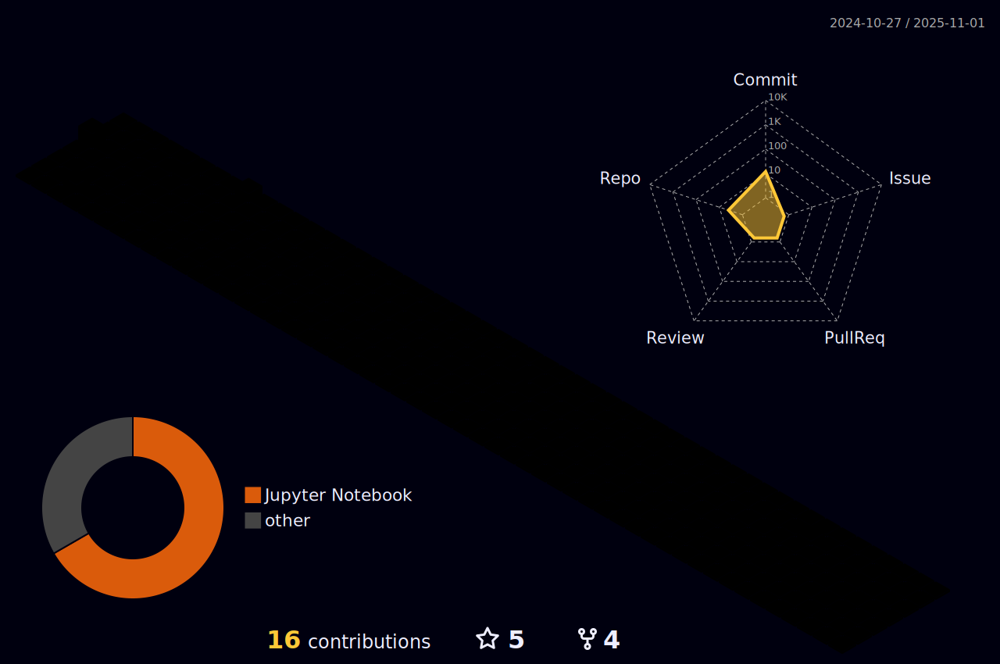

<!---
Ankushdas178/Ankushdas178 is a ✨ special ✨ repository because its `README.md` (this file) appears on your GitHub profile.
You can click the Preview link to take a look at your changes.
--->

<h1 align="center">Hi 👋🏽, I'm Ankush Dās!</h1>
<h3 align="center">A passionate CSE ( AI & ML) Student.</h3>

 
  Visitor count 
  

<h2 align="left"> About me: </h2>

- 🌱 I’m currently exploring **Cloud Tech, Machine Leaarning, NLP.**

- 👨🏽‍💻 Currently working as a Matter Expert at **Chegg.**

- 📬 You can reach me [here.](mailto:ankushdas178@gmail.com)

- ⚡ Fun fact : **Roughly 2,300,000 Gigabytes of data traffic has been distributed across the internet since you started reading this. 🤯**

 
 

<h3 align="left">Connect with me:</h3>

<a href="https://twitter.com/ankushdas178" target="blank">⠀⠀</a>
<a href="https://linkedin.com/in/ankush-das-1374221ab" target="blank">⠀⠀</a>
<a href="https://kaggle.com/ankoosh" target="blank">⠀⠀</a>
<a href="https://instagram.com/onkoosh" target="blank">⠀</a>
<a href="https://auth.geeksforgeeks.org/user/<ankushdas178>" target="blank">⠀" height="30" width="40" />⠀⠀</a>

...and of course<a href="https://www.github.com/ankushdas178"> GitHub :octocat: </a> you're already on (𝘙𝘦𝘤𝘶𝘳𝘴𝘪𝘰𝘯 😉).

<h3 align="left">Languages and Tools:</h3>

 <a href="https://www.arduino.cc/" target="_blank" rel="noreferrer"> ⠀⠀ </a> <a href="https://www.cprogramming.com/" target="_blank" rel="noreferrer">  ⠀⠀</a> <a href="https://www.w3schools.com/cpp/" target="_blank" rel="noreferrer">  ⠀⠀</a> <a href="https://www.w3schools.com/css/" target="_blank" rel="noreferrer"> ⠀⠀ </a> <a href="https://cloud.google.com" target="_blank" rel="noreferrer"> ⠀⠀ </a> <a href="https://git-scm.com/" target="_blank" rel="noreferrer"> ⠀⠀ </a> <a href="https://www.w3.org/html/" target="_blank" rel="noreferrer"> ⠀⠀ </a> <a href="https://kubernetes.io" target="_blank" rel="noreferrer"> ⠀ ⠀</a> <a href="https://www.python.org" target="_blank" rel="noreferrer">  ⠀⠀</a> <a href="https://developer.apple.com/swift/" target="_blank" rel="noreferrer"> ⠀⠀ </a> 

&nbsp;

